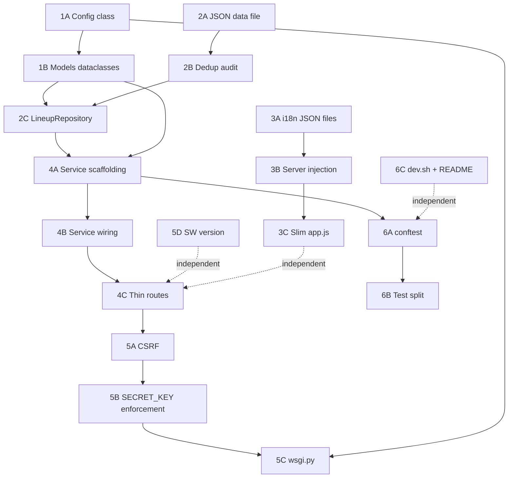

# Architecture Migration Plan — Play[my W:O:A]list

## Guiding Principles

- **No behavior changes per phase.** Each phase can be merged as a standalone PR and the app continues to pass its existing tests.
- **Simple stays simple.** No DI containers, no ORMs before they are needed, no abstract base classes for single implementations.
- **One source of truth per concern.** Translations live in one place. Band data lives in one place. Config lives in one place.
- **Testability by design.** Services are plain classes that receive their dependencies as constructor arguments. They can be instantiated and tested without a running Flask app.
- **Staged readiness.** The service and data layers are scaffolded early so that Stages 2–8 drop into slots rather than forcing route rewrites.

---

## Current Architecture Diagnosis

```
wacken_playlist/
  __init__.py           create_app factory
  routes.py             HTTP handlers + validation logic + MESSAGES i18n dict
  lineup.py             raw Python list (no model, no year support)
  templates/index.html  all app states in one file
  static/js/app.js      translations object (duplicates server MESSAGES)
  static/service-worker.js  version hardcoded in 3 places

tests/test_app.py       5 integration tests, no unit tests
```

**Confirmed problems to fix:**

- `routes.py` will become a fat controller as Spotify and OAuth logic land in Stages 2–5.
- Translations duplicated between `routes.py` (Python `MESSAGES` dict) and `app.js` (JS `translations` object). Adding a string key requires two edits in two languages.
- `lineup.py` is a raw list with no model — impossible to extend to multi-year (Stage 7) without a full rewrite.
- No `Config` class — `SECRET_KEY` silently defaults to `"dev"`, no test/production separation.
- No CSRF protection — dangerous once Stage 3 (playlist creation) causes real Spotify writes on POST.
- Service worker version (`v3`) is hardcoded in three places independently: `service-worker.js`, `CACHE_NAME`, and the `v=3` query string in `index.html`.
- Near-duplicate band entries (`"Ten56"` / `"Ten56."`, `"Troops Of Doom"` / `"The Troops Of Doom"`, etc.) will produce duplicate tracks once Spotify matching begins in Stage 2.
- `README.md` setup instructions use `py` and PowerShell exclusively — breaks macOS/Linux contributors.
- No `wsgi.py` — required by any production WSGI server (Gunicorn, uWSGI).
- All tests are integration tests against HTTP routes — business logic cannot be unit-tested because it lives inside route handlers.

---

## Target Architecture

```
wacken_playlist/
  __init__.py           unchanged — create_app factory
  config.py             Config, DevelopmentConfig, TestingConfig, ProductionConfig
  models.py             dataclasses: Band, LineupYear, PlaylistRequest, PlaylistPreview, PlaylistResult
  lineup.py             LineupRepository class — reads from data/, year-aware
  routes.py             thin HTTP handlers only — delegates to services
  services/
    spotify.py          SpotifyClient (auth, search, top tracks, create playlist)
    playlist.py         PlaylistBuilder (orchestration — uses LineupRepository + SpotifyClient)
    setlistfm.py        SetlistFmClient (stub — filled in Stage 6)
  data/
    lineups/
      wacken_2026.json  band list as data (moved out of Python source)
  i18n/
    en.json             single source of truth for EN strings
    pt-BR.json          single source of truth for PT-BR strings
  templates/
    base.html           extracted layout (head, header, script injection)
    index.html          extends base — selection and preview states only
  static/
    js/app.js           reads window.__translations injected by server (no duplication)
    service-worker.js   version driven by a single constant

tests/
  conftest.py           shared fixtures (app factory, test client, mock services)
  unit/
    test_models.py
    test_lineup.py
    test_playlist_builder.py
  integration/
    test_routes.py      current test_app.py moved here

wsgi.py                 production entry point
scripts/
  restart-dev.ps1       unchanged — Windows
  dev.sh                NEW: macOS/Linux equivalent
```

---

## Phases

### Phase 1 — Config and Models

**Goal:** give the app a typed config class and data models so every subsequent phase has a clean vocabulary. No behavior changes.

#### 1A — Config class

Create `wacken_playlist/config.py`:

```python
import os

class Config:
    SECRET_KEY = os.environ.get("SECRET_KEY") or None
    SPOTIFY_CLIENT_ID = os.environ.get("SPOTIFY_CLIENT_ID", "")
    SPOTIFY_CLIENT_SECRET = os.environ.get("SPOTIFY_CLIENT_SECRET", "")
    SPOTIFY_REDIRECT_URI = os.environ.get("SPOTIFY_REDIRECT_URI", "")
    SPOTIFY_APP_REFRESH_TOKEN = os.environ.get("SPOTIFY_APP_REFRESH_TOKEN", "")
    SETLISTFM_API_KEY = os.environ.get("SETLISTFM_API_KEY", "")

class DevelopmentConfig(Config):
    DEBUG = True
    SECRET_KEY = Config.SECRET_KEY or "dev-only-insecure"

class TestingConfig(Config):
    TESTING = True
    SECRET_KEY = "test-secret"

class ProductionConfig(Config):
    pass  # SECRET_KEY must come from environment — startup fails if absent
```

Wire into `create_app()` via `app.config.from_object(config_class)`. Remove the `app.config.from_prefixed_env()` call and the inline `os.environ.get("SECRET_KEY", "dev")` fallback.

#### 1B — Models dataclasses

Create `wacken_playlist/models.py`:

```python
from dataclasses import dataclass, field

@dataclass(frozen=True)
class Band:
    name: str
    year: int

@dataclass
class PlaylistRequest:
    playlist_name: str
    bands: list[Band]
    language: str = "en"
    song_source: str = "spotify_top"  # future values: "setlistfm"

@dataclass
class PlaylistPreview:
    playlist_name: str
    bands: list[Band]
    track_count: int

@dataclass
class PlaylistResult:
    playlist_name: str
    spotify_url: str
    track_count: int
    skipped_bands: list[str] = field(default_factory=list)
```

Pure Python dataclasses — no Flask imports, no DB, fully unit-testable in isolation.

---

### Phase 2 — Data Layer

**Goal:** move band data out of Python source code and give it a repository interface that supports multi-year lookup from day one.

#### 2A — JSON data file

Move the band list from `lineup.py` (Python list) to `wacken_playlist/data/lineups/wacken_2026.json`:

```json
{
  "year": 2026,
  "source_urls": [
    "https://www.wacken.com/en/news-details/party-on-the-first-35-bands-for-woa-2026/",
    "..."
  ],
  "bands": ["5th Avenue", "Ad Infinitum", "..."]
}
```

Updating the lineup becomes a data edit with no Python change. Stage 7 (historical years) requires only adding more JSON files — no structural change.

#### 2B — Near-duplicate audit and resolution

Before moving to JSON, resolve the confirmed near-duplicates currently in the list. Each decision must be documented in a `notes` field in the JSON for traceability:

| Pair | Issue | Action needed |
|---|---|---|
| `"Ten56"` / `"Ten56."` | Same band, one has a trailing period | Confirm canonical name |
| `"The Troops Of Doom"` / `"Troops Of Doom"` | Same band, article difference | Confirm canonical name |
| `"Skyline"` / `"Skylineband"` | Possibly same act | Confirm with source |
| `"5th Avenue"` / `"5th Avenue Hamburg"` | Possibly same act with city suffix | Confirm with source |
| `"Maschine"` / `"Maschine's Late Night Show"` | A band vs a stage event | Keep band, remove event |

The existing test `test_wacken_2026_lineup_has_no_exact_duplicates` passes today because the strings differ exactly — it will not catch these. A new test will check normalized names.

#### 2C — LineupRepository class

Replace the raw list export in `lineup.py` with a class:

```python
class LineupRepository:
    def get_bands(self, year: int) -> list[Band]: ...
    def get_available_years(self) -> list[int]: ...
    def get_source_urls(self, year: int) -> list[str]: ...
    def is_valid_band(self, name: str, year: int) -> bool: ...
```

The implementation reads from `data/lineups/{year}.json`. The interface contract is stable across all future stages — Stage 7 just adds more JSON files, no interface change.

New test: `tests/unit/test_lineup.py` — tests for `get_bands`, `is_valid_band`, duplicate invariant (moved from `test_app.py`).

---

### Phase 3 — i18n Centralization

**Goal:** eliminate the duplication between the server-side `MESSAGES` dict and the client-side `translations` object. One edit in one place to add or change any string.

#### 3A — JSON translation files

Create `wacken_playlist/i18n/en.json` and `wacken_playlist/i18n/pt-BR.json` containing all strings used by both server-side validation and client-side UI. Structured as a flat key/value map with pluralization handled by format strings where needed.

#### 3B — Server injection pattern

Add a loader function in the package:

```python
def load_translations(language: str) -> dict:
    path = Path(__file__).parent / "i18n" / f"{language}.json"
    with path.open(encoding="utf-8") as f:
        return json.load(f)
```

The server passes translations for the active language to Jinja2 for server-rendered strings. It also injects the full bundle as a script tag in `base.html`:

```html
<script>window.__translations = {{ translations_bundle | tojson }};</script>
```

This means the client always has the full bundle available for language switching without an extra request.

#### 3C — Slim app.js i18n

`app.js` removes its hardcoded `translations` object entirely and reads from `window.__translations`. The language-switching logic is unchanged — it applies the same dictionary structure, just sourced differently.

Result: adding any new string or validation message is a single edit to a JSON file with no Python or JS change.

---

### Phase 4 — Service Layer Scaffolding

**Goal:** create the service layer before Stage 2 lands so that Spotify lookup code has a proper home and never touches `routes.py`.

#### 4A — `services/` package

Three modules, all with plain constructor injection (no Flask globals inside service classes):

`wacken_playlist/services/spotify.py`:

```python
class SpotifyClient:
    def __init__(self, client_id: str, client_secret: str, redirect_uri: str): ...
    def get_client_credentials_token(self) -> str: ...
    def search_artist(self, name: str) -> dict | None: ...
    def get_top_tracks(self, artist_id: str, market: str = "US") -> list[dict]: ...
    def create_playlist(self, name: str, track_uris: list[str]) -> str: ...
```

`wacken_playlist/services/playlist.py`:

```python
class PlaylistBuilder:
    def __init__(self, spotify: SpotifyClient): ...
    def build_preview(self, request: PlaylistRequest) -> PlaylistPreview: ...
    def build_and_create(self, request: PlaylistRequest) -> PlaylistResult: ...
```

`wacken_playlist/services/setlistfm.py` — stub only, interface defined, implementation deferred to Stage 6:

```python
class SetlistFmClient:
    def __init__(self, api_key: str): ...
    def get_latest_setlist(self, artist_name: str) -> list[str] | None: ...
```

#### 4B — Service wiring in `create_app()`

Services are stateless, so they are instantiated once at startup and stored on `app`:

```python
def create_app(config_class=DevelopmentConfig):
    app = Flask(__name__)
    app.config.from_object(config_class)
    app.lineup = LineupRepository()
    app.spotify = SpotifyClient(
        app.config["SPOTIFY_CLIENT_ID"],
        app.config["SPOTIFY_CLIENT_SECRET"],
        app.config["SPOTIFY_REDIRECT_URI"],
    )
    app.playlist_builder = PlaylistBuilder(app.spotify)
    ...
```

Routes access services via `current_app.spotify`, `current_app.lineup`. No import-time side effects, no module-level globals.

#### 4C — Thin `routes.py`

Route handlers become HTTP glue only: parse request → call service → render result.

```python
@main.post("/preview")
def preview():
    selected = request.form.getlist("bands")
    playlist_name = request.form.get("playlist_name", "").strip()
    language = normalize_language(request.form.get("language", "en"))
    errors = validate(playlist_name, selected, language)
    preview_data = None
    if not errors:
        req = PlaylistRequest(playlist_name=playlist_name, bands=selected, language=language)
        preview_data = current_app.playlist_builder.build_preview(req)
    return render_template("index.html", ..., preview=preview_data, errors=errors)
```

No business logic in routes. No API calls in routes.

New test: `tests/unit/test_playlist_builder.py` — tests `PlaylistBuilder` with a mock `SpotifyClient`. Since `SpotifyClient` is injected, no HTTP calls are made in unit tests.

---

### Phase 5 — Security and Platform Hardening

**Goal:** close the security gaps before Stages 3 and 5 introduce OAuth and user sessions.

#### 5A — CSRF protection

Add `Flask-WTF` to `requirements.txt`. Enable `CSRFProtect(app)` in `create_app()`. Add `{{ csrf_token() }}` as a hidden field in all POST forms. Exempt the `/health` endpoint.

This must be done before Stage 3 (playlist creation) so that real Spotify writes are not exposed to cross-site request forgery.

#### 5B — `SECRET_KEY` enforcement

`ProductionConfig` fails loudly at startup if `SECRET_KEY` is absent:

```python
class ProductionConfig(Config):
    @classmethod
    def validate(cls):
        if not os.environ.get("SECRET_KEY"):
            raise RuntimeError("SECRET_KEY must be set in production.")
```

`DevelopmentConfig` keeps a fallback but logs a visible warning so the gap is never silent.

#### 5C — `wsgi.py` production entry point

Add a top-level `wsgi.py`:

```python
from wacken_playlist import create_app
from wacken_playlist.config import ProductionConfig

application = create_app(ProductionConfig)
```

Required for Gunicorn (`gunicorn wsgi:application`), uWSGI, and most Flask-friendly hosts in Stage 9.

#### 5D — Service worker version management

The current state has the cache version string in three independent places. Replace with a single source:

- Add `wacken_playlist/version.py` containing `APP_VERSION = "1.0.0"`.
- `create_app()` injects `app_version` into all template contexts via `app.context_processor`.
- `base.html` uses `v={{ app_version }}` in all `url_for` static file calls.
- `base.html` injects `window.__appVersion = "{{ app_version }}";` into a script tag.
- `service-worker.js` sets `const CACHE_NAME = "wacken-playlist-" + self.__appVersion;`.

One version bump in `version.py` now consistently invalidates all caches and busts all static file query strings.

---

### Phase 6 — Test Architecture

**Goal:** establish a test structure that makes unit and integration tests easy to add as the service layer grows through Stages 2–8.

#### 6A — `conftest.py` and shared fixtures

Create `tests/conftest.py`:

```python
import pytest
from unittest.mock import MagicMock
from wacken_playlist import create_app
from wacken_playlist.config import TestingConfig

@pytest.fixture
def app():
    return create_app(TestingConfig)

@pytest.fixture
def client(app):
    return app.test_client()

@pytest.fixture
def mock_spotify():
    mock = MagicMock()
    mock.search_artist.return_value = {"id": "abc123", "name": "Test Band"}
    mock.get_top_tracks.return_value = [{"uri": "spotify:track:xyz", "name": "Song 1"}]
    return mock
```

#### 6B — `unit/` and `integration/` split

Move `tests/test_app.py` to `tests/integration/test_routes.py`. Create:

- `tests/unit/test_models.py` — `PlaylistRequest` validation, `Band` equality, frozen dataclass behavior.
- `tests/unit/test_lineup.py` — `LineupRepository.get_bands()`, `is_valid_band()`, duplicate invariant, unknown year handling.
- `tests/unit/test_playlist_builder.py` — `build_preview()` and `build_and_create()` with mocked `SpotifyClient`. Covers: correct track count, skipped bands on missing artist, deduplication behavior, empty selection.

Unit tests import no Flask app and make no HTTP calls. Integration tests use `app.test_client()` and mock services at the `TestingConfig` level.

#### 6C — Cross-platform developer scripts

Add `scripts/dev.sh`:

```bash
#!/usr/bin/env bash
set -e
PORT=${1:-1337}
pkill -f "flask.*wacken_playlist" 2>/dev/null || true
python -m flask --app wacken_playlist:create_app --debug run --host 127.0.0.1 --port "$PORT"
```

Update `README.md` to document both `scripts/restart-dev.ps1` (Windows) and `scripts/dev.sh` (macOS/Linux) and replace `py` with `python` / `python3` in all cross-platform commands.

---

## Phase Dependency Map



---

## App Stage Unlock Map

| App Stage | Architecture prerequisite from this plan |
|---|---|
| Stage 2 — Spotify lookup | Phase 4 service layer must exist so `SpotifyClient` has a home |
| Stage 3 — Playlist creation | Phase 5A CSRF + Phase 5B `SECRET_KEY` before real Spotify writes |
| Stage 4 — PWA polish | Phase 5D service worker version management |
| Stage 5 — User OAuth | Phase 5C `wsgi.py` + Phase 5B `ProductionConfig` validation |
| Stage 6 — setlist.fm | `services/setlistfm.py` stub from Phase 4A is already in place |
| Stage 7 — Historical years | Phase 2C `LineupRepository.get_available_years()` already supports it |
| Stage 8 — Shuffle | Phase 4A `PlaylistBuilder` is the natural home for shuffle logic |
| Stage 9 — Deployment | Phase 5C `wsgi.py` + Phase 5B `ProductionConfig` validation |

---

## Explicit Non-Goals

The following are intentionally excluded to avoid overengineering at this app size:

- No ORM — SQLite for Stage 5 OAuth sessions will use `Flask-Session` or a simple shelve file, not SQLAlchemy.
- No Blueprint split — `routes.py` is small enough. An `auth` blueprint is added only when OAuth routes land in Stage 3.
- No frontend framework — vanilla JS stays throughout. The i18n injection pattern in Phase 3 is sufficient.
- No API versioning — the app has no external API consumers.
- No Docker — deferred to Stage 9 if the chosen host requires it.
- No message queue or async tasks — Spotify API calls are synchronous for now; async is only reconsidered if rate limiting becomes a production issue in Stage 9.
